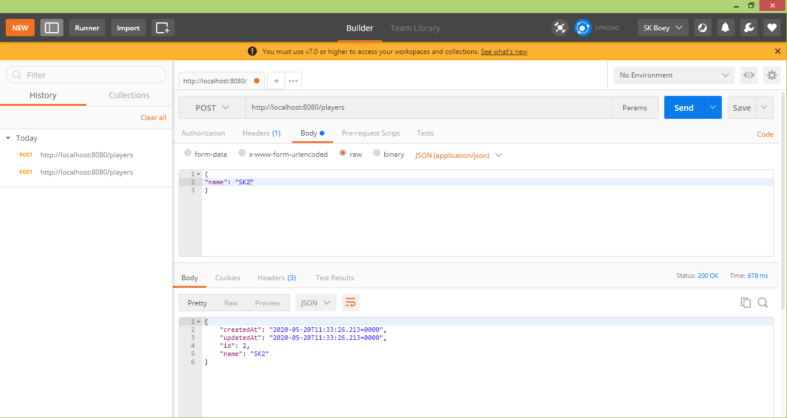
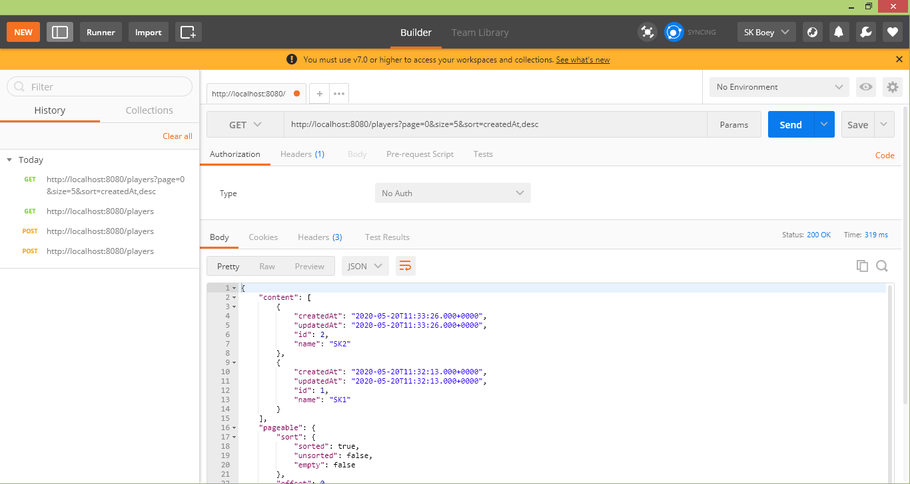
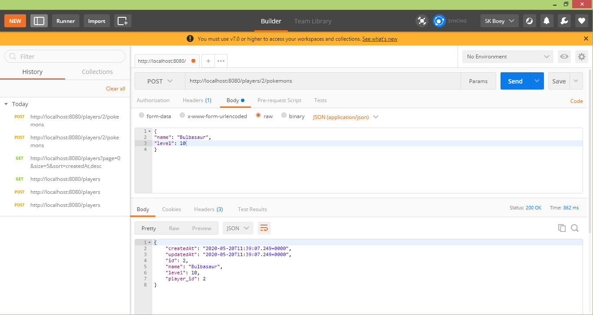

# Pokedex-API-Server
A Spring-boot MVC application with a REST controller for Pokemon application. It has one-to-many relation for Player and Pokemon. Each Pokemon has a Player attached to it.

## Built With
The following technologies:
- Java
- Spring-boot MVC 
- REST API/JSON 
- Eclipse

The application exposes the following APIs:
- Insert/Update/Delete Player
- Insert/Update/Delete Pokemon
- Show the Pokemon inventory list that owned by particular Player 

Data persisted on mySQL using JPA.

## DB Config

application.properties:
spring.datasource.url : define DB source

spring.datasource.username : define DB user name

spring.datasource.password : define DB user password

## Test Cases
To run it, right click on PokeDexDemoApplication.java -> Run As -> Java Application

1. Player 1 and Player 2 Creation

Player 1: SK1

Player 2: SK2

2. List of Player 1 and Player 2

3. Pokemons created for Player 2

First Catch: Bulbasaur (level 1)

Second Catch: Bulbasaur (level 10)

Third Catch: Bulbasaur (level 1)

Fourth Catch: Ivysaur (level 2)

4. Pokemon Inventory Summary for Player 1 and Player 2

Player 1: Empty Pokemon basket

Player 2: Pokemon basket: 2 Bulbasaur (level 1) + 1 Bulbasaur (level 10) + 1 Ivysaur (level 2)

5. Update Name for Player 1

Player 1: SK1 -> SK1_New

6. Delete Player 2

7. Refresh of Player List

Player 1: SK1_New, Player 2 deleted

